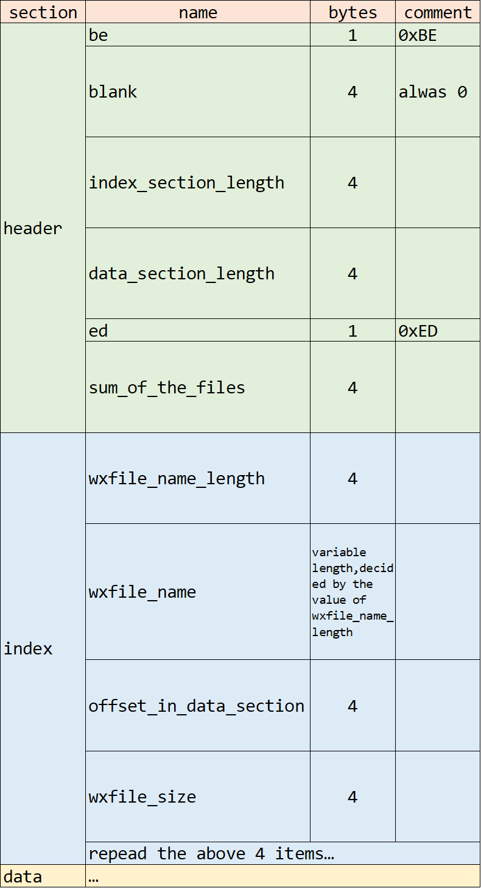

# decrypt and resolve wxapkg file
test on python 3.10, WeChat Windows PC 3.5.0.46

```pip install pycryptodome``` or download pycryptodome from this [link](https://files.pythonhosted.org/packages/19/81/45b2ea1fd90d7caa0e5aa36a373d136f7e4c07c129f3018c89e699777cf8/pycryptodome-3.14.1-cp35-abi3-win_amd64.whl) (only test on windows)  and run ```pip install pycryptodome.whl```

The structure of decrypted wxapkg file should look like this: